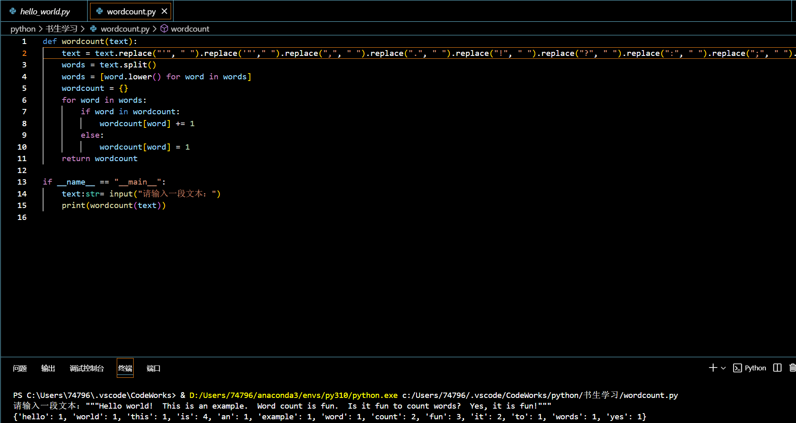
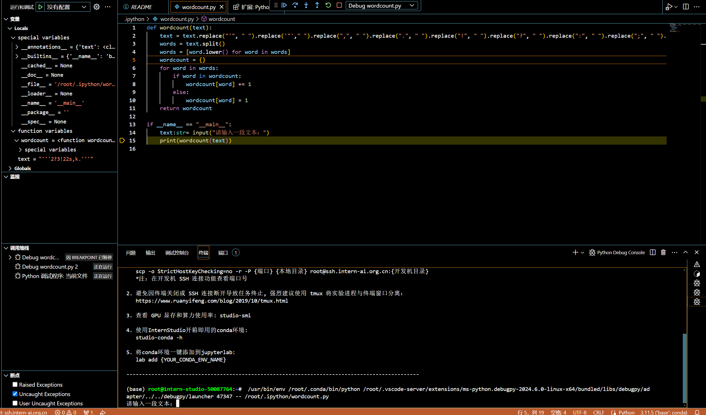

任务1:

任务2:

（先上截图）

debug笔记：

日期：2024年7月10日 

问题描述：远程对wordcount进行调试，确保正常运行。

调试环境：

* 开发机：远程的InternStudio
* 编程语言：Python
* 调试工具：vscode

调试步骤：

1. Vscode连接InternStudio，加载项目。
2. 在代码中找到可能有问题的位置，并设置断点。
3. 开始调试，程序执行到断点时暂停。
4. 查看变量值和调用栈，发现变量值不符合预期。
5. 使用单步执行功能，发现问题出现在某一行代码。
6. 根据信息，找到问题所在，并进行修复。
7. 修复问题后，继续执行程序并进行测试，验证问题已经解决。
8. 问题原因：标点符号未被完全地正确地替换掉。

修复方案： 

修改代码，标点符号在执行后续代码前已经被全部替换成空格。

问题解决： 

经过调试和修复，程序不再出现异常，问题已经解决。
